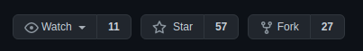
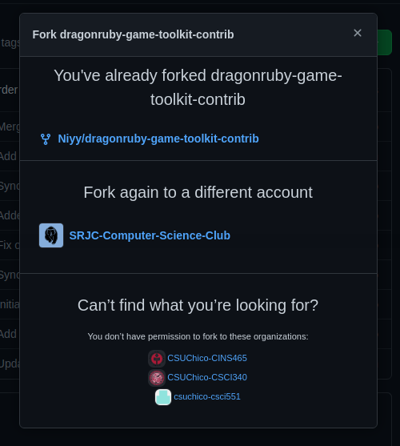
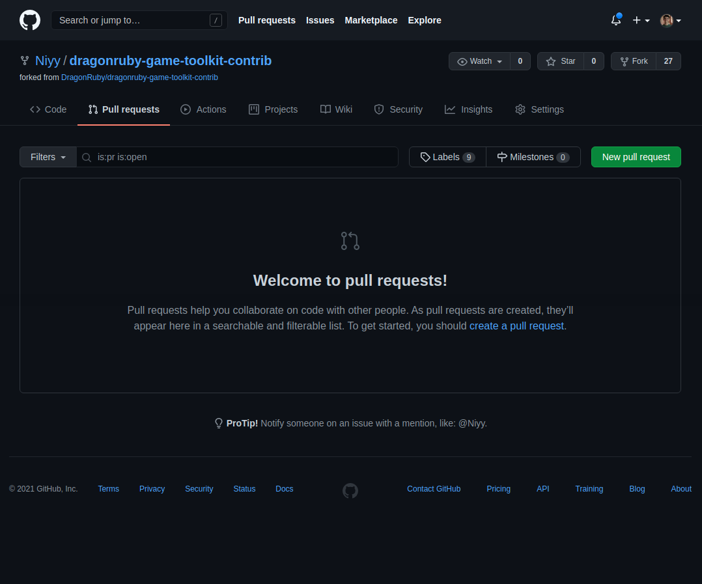

# How to Use

This repository requires DragonRuby Game Toolkit. You can purchase a license from http://dragonruby.org.

If your income is below $1000 per month, are a "student", or are a "big time Raspberry PI enthusiast", contact Amir at ar@amirrajan.net with a short explanation of your current situation, and he'll set you up with a free license, no questions asked.

1. Download DragonRuby Game Toolkit.
2. Unzip.
3. Navigate to your game folder using terminal (the default game folder is `./mygame/app`).
4. `git clone https://github.com/DragonRuby/dragonruby-game-toolkit-contrib` or download and unzip into the `./mygame/app` directory. 

IMPORTANT: _do not_ try to symlink the git repo into the `./mygame/app` directory (or anything else fancy), the DragonRuby Runtime requires everything to reside in the game directory and will not allow access outside of it.

IMPORTANT: make sure Git is configured to not change line endings (especially if you're cloning on Windows):

```
git config --system core.autocrlf false
git config --global core.autocrlf false
```

5. Your directory structures should look  like the following:

```
DragonRuby
|
+- mygame/
   |
   +- app/
      |
      +- main.rb
      +- repl.rb
      +- documentation/
      |
      +- dragonruby-game-toolkit-contrib/ (this repository)
         |
         +- dragon/
         |  |
         |  +- docs.rb
         |  +- [other source files]
```

6. Open `main.rb` and add a `require` statement for the source file you want to edit. For example, if you want to edit `docs.rb`, your `mygame/main.rb` would look like this:

```ruby
require 'app/dragonruby-game-toolkit-contrib/dragon/docs.rb'

def tick args
end
```

[Here is the final result](final-result.mp4)

# Instructions on how to fork and contribute

Welcome to forking and contributing to this wonderful project. To officially make changes to the OSS you must first fork this repo. To do this you must navigate that lovely cursor up to the top right of this page. You will see three icons: Watch, star and fork. By now you probably know which one you want to click (It is the one titled fork).
 

 
Once you have clicked the fork button, a new window will pop up asking you what identity or organization you want to fork to. Choose your main profile. In my case I have already forked to my identity, but you should be able to find your's here.
 

 
After cloning your forked version to your local machine, you can make changes to relevant files. When you have wrapped up, you will want to put your name at the top of the file under `#Contributors outside of DragonRuby who also hold Copyright:`. If this string does not exist go ahead and add it under the top comments. Then you can add to your next commit, commit, and push your changes up to your repo. Now that we have our changes in github we can make a pull request. You are going to want to head on back to your fancy dragonruby-game-toolkit-contrib fork on github. Right below the repo title, you will see a good number of tabs. You are going to click on the one titled Pull requests (It is right next to Code). We are almost contributors! Yay!
 
Now that we are in the Pull requests tab, you can go ahead and click the nice green button titled New pull request.


 
You will now be in the pull request compare stage. It goes over all the changes you have made to the base code. This will take you too the comment page. You should always leave a few comments about what you changed and why. It helps people who follow you understand why you made these changes. Now hit that button (It is another green one)!
 
Congratulations! Once an admin merges your changes, you will be a DragonRubyGTK contributor. Wear that title with pride!

---
1. make a fork of DRs repo
2. `git clone` your fork into the `mygame` folder of your install
3. add a remote that is kfischer's repo
4. `git branch` into `zil-interpreter` (can be any name really) 
5. `git fetch` kfischer's repo
6. run this thing with `dragonruby mygame/path/to/samples/99_zil_interpreter`
7. do changes, see if they don't break
8. write tests (or kfischer will find you)
9. PR