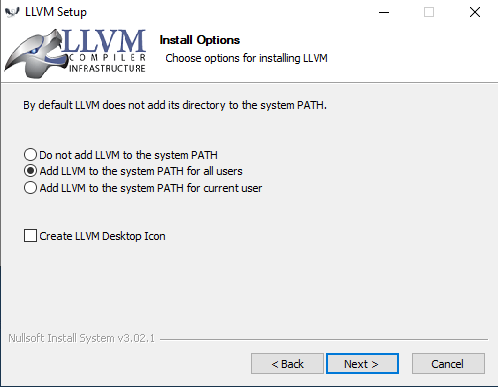
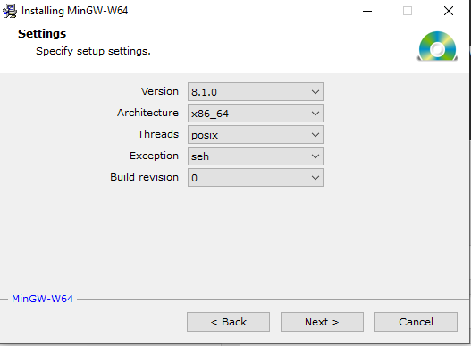

# C Extensions introduction

This sample app serves as an introduction on how to write C extensions for the
DragonRuby Game Toolkit. You'll need a Pro License
which can be purchased at http://dragonruby.org. The sample app is provided in
the Standard license for those that are curious as to what implementing C Extensions
looks like.

## Requirements

In order to use C extensions you need a C compiler. We strongly recommend you
using [Clang](https://clang.llvm.org).

### Windows

To get Clang for Windows you can use the [official build](https://github.com/llvm/llvm-project/releases/download/llvmorg-10.0.0/LLVM-10.0.0-win64.exe).

During installation, make sure to choose "Add LLVM to the system PATH for all
users", as on the screenshot 

On Windows, you also need to install MinGW-w64 toolchain from [here](http://mingw-w64.org/doku.php/download/mingw-builds)
Set the installation directory to "C:\mingw-w64":  and on the next step choose the right version and the
other setting as on the screenshot: .


### Linux

On Debian-based systems you can install Clang via `apt`. It is recommended you
install `clang-10`, but any other 'reasonably' fresh version should work just
fine:

```
> apt-get install clang-10
> clang-10 --version
Apple clang version 10.0.0-4ubuntu1-18.04.2
Target: x86_64-pc-linux-gnu
Thread model: posix
InstalledDir: /usr/bin
```

Raspberry Pi instructions are mostly the same as x86-64 Linux. Out of the box,
Clang can cross-compile for the Pi on any platform, but you'll need to set up
a proper sysroot, which can be complicated, and beyond the scope of this
document. The bold--and patient--can always compile on the Pi device directly,
too.


### macOS

To get Clang on macOS it is recommended to install [Xcode](https://developer.apple.com/xcode/).
Once you've done that you should be able to use Clang from a terminal:

```
> clang --version
Apple clang version 11.0.3 (clang-1103.0.32.29)
Target: x86_64-apple-darwin19.5.0
Thread model: posix
InstalledDir: /Applications/Xcode.app/Contents/Developer/Toolchains/XcodeDefault.xctoolchain/usr/bin
```

### Android

For Android, you can [install the Android NDK](https://developer.android.com/ndk/)
on Windows, Linux, or macOS. This lets you compile C code for the platform. You
won't be using Java here.

DragonRuby ships with support for Android on arm32, arm64, x86, and x86-64. This might
be overkill, but it allows for maximum hardware compatibility. You should plan to
compile for all four architectures too, but of course this is optional.


## Hello World

Let's craft the simplest possible C extension: a simple function that
calculates square of an integer. Put the following code into a file named
`ext.c` under `mygame` directory:

```
int square(int x) {
  return x * x;
}
```

You need some glue code to connect this function to the GameToolKit. Good news
are that you don't need to craft this code yourself: it can be generated for
you by `dragonruby-bind` (or `dragonruby-bind.exe` if you are on Windows).

Run the following command from Linux/macOS terminal:

```
> ./dragonruby-bind --output=mygame/ext-bind.c mygame/ext.c
```

Or from Windows Powershell:

```
> .\dragobruby-bind.exe --output=mygame\ext-bind.c mygame\ext.c
```

With the `ext-bind.c` in place you can compile your C extension into a dynamic
or shared library. Here is how you do it:

On Windows:

```
clang -shared \
  --sysroot=C:\mingw-w64\mingw64^
  --target=x86_64-w64-mingw32 -fuse-ld=lld^
  -isystem include -I . -fPIC^
  -o mygame\native\windows-amd64\ext.dll mygame\ext-bind.c
```

On Linux:

```
> clang -shared \
  -isystem include -I . -fPIC \
  -o mygame/native/linux-amd64/ext.so mygame/ext-bind.c
```

On Raspberry Pi, on the device:

```
> clang -shared \
  -isystem include -I . -fPIC \
  -o mygame/native/linux-raspberrypi/ext.so mygame/ext-bind.c
```

On Raspberry Pi, with a cross-compiler:

```
> clang -shared --sysroot=/where/i/installed/a/sysroot \
  --target=arm-linux-gnueabihf -fuse-ld=lld \
  -isystem include -I . -fPIC \
  -o mygame/native/linux-raspberrypi/ext.so mygame/ext-bind.c
```

On macOS:

```
> clang -shared \
  -isystem include -I . -fPIC \
  -o mygame/native/macos/ext.dylib mygame/ext-bind.c
```

On Android:

(This is what it looks like on Linux, change the appropriate parts for Windows, etc)

```
> android-ndk-r21d/toolchains/llvm/prebuilt/linux-x86_64/bin/clang \
  --target=armv7-none-linux-androideabi26 \
  --gcc-toolchain=android-ndk-r21d/toolchains/llvm/prebuilt/linux-x86_64 \
  --sysroot=/home/icculus/projects/dragonruby/build-tools/host/Linux-amd64/android-ndk-r21d/toolchains/llvm/prebuilt/linux-x86_64/sysroot \
  -DANDROID -fdata-sections -ffunction-sections -funwind-tables -fstack-protector-strong -no-canonical-prefixes -D_FORTIFY_SOURCE=2 -march=armv7-a \
  -mthumb -fno-limit-debug-info -fPIC -shared \
  -o mygame/native/android-arm32/ext.so mygame/ext-bind.c

> android-ndk-r21d/toolchains/llvm/prebuilt/linux-x86_64/bin/clang \
  --target=aarch64-none-linux-android26 \
  --gcc-toolchain=android-ndk-r21d/toolchains/llvm/prebuilt/linux-x86_64 \
  --sysroot=/home/icculus/projects/dragonruby/build-tools/host/Linux-amd64/android-ndk-r21d/toolchains/llvm/prebuilt/linux-x86_64/sysroot \
  -DANDROID -fdata-sections -ffunction-sections -funwind-tables -fstack-protector-strong -no-canonical-prefixes -D_FORTIFY_SOURCE=2 \
  -fno-limit-debug-info -fPIC -shared \
  -o mygame/native/android-arm64/ext.so mygame/ext-bind.c

> android-ndk-r21d/toolchains/llvm/prebuilt/linux-x86_64/bin/clang \
  --target=i686-none-linux-android26 \
  --gcc-toolchain=android-ndk-r21d/toolchains/llvm/prebuilt/linux-x86_64 \
  --sysroot=/home/icculus/projects/dragonruby/build-tools/host/Linux-amd64/android-ndk-r21d/toolchains/llvm/prebuilt/linux-x86_64/sysroot \
  -DANDROID -fdata-sections -ffunction-sections -funwind-tables -fstack-protector-strong -no-canonical-prefixes -D_FORTIFY_SOURCE=2 \
  -fno-limit-debug-info -fPIC -shared \
  -o mygame/native/android-x86/ext.so mygame/ext-bind.c

> android-ndk-r21d/toolchains/llvm/prebuilt/linux-x86_64/bin/clang \
  --target=x86_64-none-linux-android26 \
  --gcc-toolchain=android-ndk-r21d/toolchains/llvm/prebuilt/linux-x86_64 \
  --sysroot=/home/icculus/projects/dragonruby/build-tools/host/Linux-amd64/android-ndk-r21d/toolchains/llvm/prebuilt/linux-x86_64/sysroot \
  -DANDROID -fdata-sections -ffunction-sections -funwind-tables -fstack-protector-strong -no-canonical-prefixes -D_FORTIFY_SOURCE=2 \
  -fno-limit-debug-info -fPIC -shared \
  -o mygame/native/android-amd64/ext.so mygame/ext-bind.c
```


Now, include the following snippet into the very beginning of `mygame/app/main.rb`:

```
$gtk.ffi_misc.gtk_dlopen("ext")
include FFI::CExt
puts square(11)
```

Now, simply run `dragonruby` (or `dragonruby.exe`) and you should see `121` on
the console.

Let's do a breakdown of each line!

1. `$gtk.ffi_misc.gtk_dlopen("ext")` - DragonRuby exposes a special function
    called `gtk_dlopen`, you can use it to load a dynamic that holds
    the C extension code. It looks for the shared library in
    "mygame/native/$PLATFORM/ext.$PLATFORM_DLL_EXTENSION"
2. `include FFI::CExt` - by default, DragonRuby puts all the code available in
   the C extension under `FFI::CExt` module. This line serves as a shortcut so
   that you don't need to write `FFI::CExt::square` any time you want to call
   a function.
3. `puts square(11)` - this line simply prints the value returned from C code.

Now, you can call the `square` function at any place in the code. Let's see
what's the square value of every pixel on the screen. Here is the full program:

```
$gtk.ffi_misc.gtk_dlopen("ext")
include FFI::CExt

def tick args
  args.outputs.labels  << [640, 500, "mouse.x = #{args.mouse.x.to_i}", 5, 1]
  args.outputs.labels  << [640, 460, "square(mouse.x) = #{square(args.mouse.x.to_i)}", 5, 1]
  args.outputs.labels  << [640, 420, "mouse.y = #{args.mouse.y.to_i}", 5, 1]
  args.outputs.labels  << [640, 380, "square(mouse.y) = #{square(args.mouse.y.to_i)}", 5, 1]
end
```

When you run the game now, you will see something like this:


