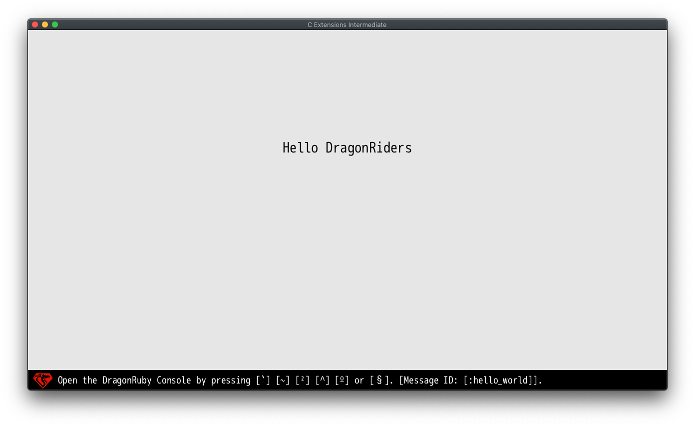

# C Extensions introduction

This sample app is the next step on mastering C extensions for the
DragonRuby Game Toolkit. You'll need a Pro License which can be purchased at
http://dragonruby.org. The sample app is provided in the Standard license for
those that are curious as to what implementing C Extensions looks like.

## Requirements

Make sure you went through the first example '01_basics'.

## Regular Expressions

This sample shows how to use a third-party C library. We use a library for
regular expressions: https://github.com/kokke/tiny-regex-c.

The library comes with two files `re.c` and `re.h`. We need to generate bindings
from the header file. By default, DragonRuby generates bindings under `CExt`
module. This can be overriden by `--ffi-module=` command line flag.

Run the following command from Linux/macOS terminal:

```
> ./dragonruby-bind --output=mygame/re-bindings.c --ffi-module=RE mygame/re.h
```

Or from Windows Powershell:

```
> .\dragobruby-bind.exe --output=mygame\re-bindings.c --ffi-module=RE mygame\re.h
```

Now you can compile the library together with the generated bindings.

On Windows:

```
clang -shared \
  --sysroot=C:\mingw-w64\mingw64^
  --target=x86_64-w64-mingw32 -fuse-ld=lld^
  -isystem include -I . -fPIC^
  -o mygame\native\windows-amd64\ext.dll mygame\re.c mygame\re-bindings.c
```

On Linux:

```
> clang -shared \
  -isystem include -I . -fPIC \
  -o mygame/native/linux-amd64/ext.so mygame/re-bindings.c mygame/re.c
```

On Raspberry Pi, on the device:

```
> clang -shared \
  -isystem include -I . -fPIC \
  -o mygame/native/linux-raspberrypi/ext.so mygame/re-bindings.c mygame/re.c
```

On Raspberry Pi, with a cross-compiler:

```
> clang -shared --sysroot=/where/i/installed/a/sysroot \
  --target=arm-linux-gnueabihf -fuse-ld=lld \
  -isystem include -I . -fPIC \
  -o mygame/native/linux-raspberrypi/ext.so mygame/re-bindings.c mygame/re.c
```

On macOS:

```
> clang -shared \
  -isystem include -I . -fPIC \
  -o mygame/native/macos/ext.dylib mygame/re-bindings.c mygame/re.c
```

On Android:

(This is what it looks like on Linux, change the appropriate parts for Windows, etc)

```
> android-ndk-r21d/toolchains/llvm/prebuilt/linux-x86_64/bin/clang \
  --target=armv7-none-linux-androideabi26 \
  --gcc-toolchain=android-ndk-r21d/toolchains/llvm/prebuilt/linux-x86_64 \
  --sysroot=/home/icculus/projects/dragonruby/build-tools/host/Linux-amd64/android-ndk-r21d/toolchains/llvm/prebuilt/linux-x86_64/sysroot \
  -DANDROID -fdata-sections -ffunction-sections -funwind-tables -fstack-protector-strong -no-canonical-prefixes -D_FORTIFY_SOURCE=2 -march=armv7-a \
  -mthumb -fno-limit-debug-info -fPIC -shared \
  -o mygame/native/android-arm32/ext.so mygame/re-bindings.c mygame/re.c

> android-ndk-r21d/toolchains/llvm/prebuilt/linux-x86_64/bin/clang \
  --target=aarch64-none-linux-android26 \
  --gcc-toolchain=android-ndk-r21d/toolchains/llvm/prebuilt/linux-x86_64 \
  --sysroot=/home/icculus/projects/dragonruby/build-tools/host/Linux-amd64/android-ndk-r21d/toolchains/llvm/prebuilt/linux-x86_64/sysroot \
  -DANDROID -fdata-sections -ffunction-sections -funwind-tables -fstack-protector-strong -no-canonical-prefixes -D_FORTIFY_SOURCE=2 \
  -fno-limit-debug-info -fPIC -shared \
  -o mygame/native/android-arm64/ext.so mygame/re-bindings.c mygame/re.c

> android-ndk-r21d/toolchains/llvm/prebuilt/linux-x86_64/bin/clang \
  --target=i686-none-linux-android26 \
  --gcc-toolchain=android-ndk-r21d/toolchains/llvm/prebuilt/linux-x86_64 \
  --sysroot=/home/icculus/projects/dragonruby/build-tools/host/Linux-amd64/android-ndk-r21d/toolchains/llvm/prebuilt/linux-x86_64/sysroot \
  -DANDROID -fdata-sections -ffunction-sections -funwind-tables -fstack-protector-strong -no-canonical-prefixes -D_FORTIFY_SOURCE=2 \
  -fno-limit-debug-info -fPIC -shared \
  -o mygame/native/android-x86/ext.so mygame/re-bindings.c mygame/re.c

> android-ndk-r21d/toolchains/llvm/prebuilt/linux-x86_64/bin/clang \
  --target=x86_64-none-linux-android26 \
  --gcc-toolchain=android-ndk-r21d/toolchains/llvm/prebuilt/linux-x86_64 \
  --sysroot=/home/icculus/projects/dragonruby/build-tools/host/Linux-amd64/android-ndk-r21d/toolchains/llvm/prebuilt/linux-x86_64/sysroot \
  -DANDROID -fdata-sections -ffunction-sections -funwind-tables -fstack-protector-strong -no-canonical-prefixes -D_FORTIFY_SOURCE=2 \
  -fno-limit-debug-info -fPIC -shared \
  -o mygame/native/android-amd64/ext.so mygame/re-bindings.c mygame/re.c
```

Now, the C extension is available under the `FFI::RE` namespace.

```
$gtk.ffi_misc.gtk_dlopen("ext")
include FFI::RE
```

The `tiny-regex-c` exposes three functions, we are interested in the last one:

```c
int re_match(const char* pattern, const char* text, int* matchlength);
```

The first argument is the regex pattern to search for. The second one is the
actual text we want to search through. The last argument is a pointer to an
integer: it stores the location of the last character found in the text.
The function returns the first location of the found pattern, or -1 if the
pattern is not found. The usage in DragonRuby is straightforward:

```ruby
$gtk.ffi_misc.gtk_dlopen("ext")
include FFI::RE

input = "<<Hello, DragonRiders!>>"
last = IntPointer.new
first = re_match("\\w+", input, last)
if first != -1
  puts "Found a word (#{first}, #{last.value}): '#{input.slice(first, last.value)}'"
end

def tick args
end
```

When you run the game you should see `Found a word (2, 5): 'Hello'` on the console.

Two things are worth mentioning. The C API requires `const char *` and `int *`.
In case of strings, DragonRuby does the transformation for you transparently.
In the case of `int *` you have to create the right pointer manually (`IntPointer.new`).
The good thing is that you don't need to free or deallocate this memory manually:
DragonRuby also does this for you transparently.

With this knowledge, we can now create a slightly more complex function that
splits input into an array of words:

```ruby
$gtk.ffi_misc.gtk_dlopen("ext")
include FFI::RE

def split_words(input)
  words = []
  last = IntPointer.new
  re = re_compile("\\w+")
  first = re_matchp(re, input, last)
  while first != -1
    words << input.slice(first, last.value)
    input = input.slice(last.value + first, input.length)
    first = re_matchp(re, input, last)
  end
  words
end

input = "<<Hello, DragonRiders!>>"

def tick args
  args.outputs.labels  << [640, 500, split_words(input).join(' '), 5, 1]
end
```
 
Now, you should see a big label with "Hello DragonRiders" on it.


