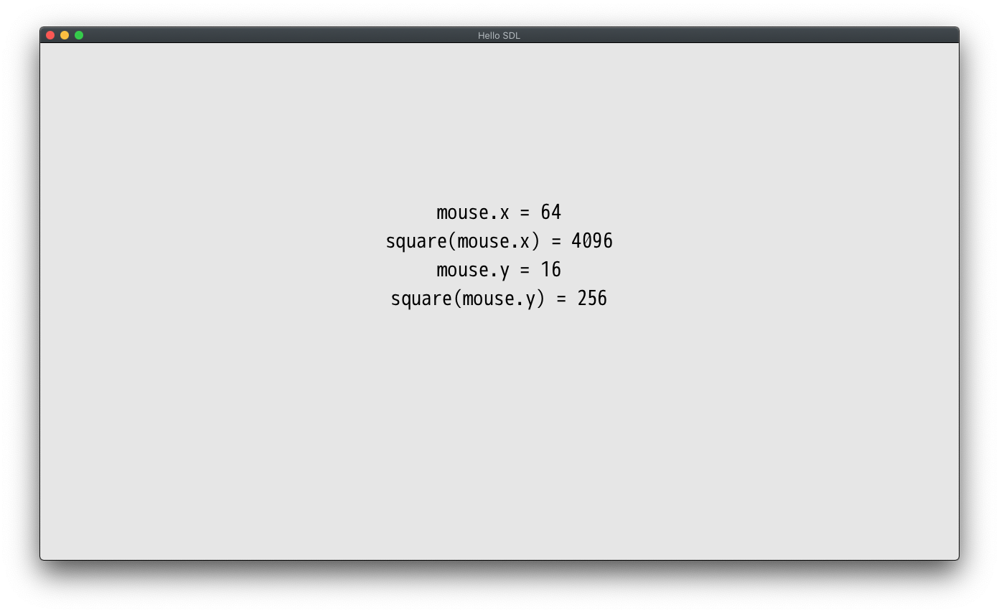

# Rust Extensions introduction

This sample app serves as an introduction on how to write Rust extensions for the
DragonRuby Game Toolkit. You'll need a Pro License
which can be purchased at http://dragonruby.org. The sample app is provided in
the Standard license for those that are curious as to what implementing Rust Extensions
looks like.

This has only been tested on MacOS but should work on any platform that Rust supports.

## Requirements

In order to use Rust extensions you need a C compiler. We strongly recommend you
using [Clang](https://clang.llvm.org).
You'll also need the Rust compiler which you can install using [rustup](https://rustup.rs).
Finally you'll need a rust tool [cbindgen](https://github.com/eqrion/cbindgen).

### macOS

To get Clang on macOS it is recommended to install [Xcode](https://developer.apple.com/xcode/).
Once you've done that you should be able to use Clang from a terminal:

```
> clang --version
Apple clang version 11.0.3 (clang-1103.0.32.29)
Target: x86_64-apple-darwin19.5.0
Thread model: posix
InstalledDir: /Applications/Xcode.app/Contents/Developer/Toolchains/XcodeDefault.xctoolchain/usr/bin
```

## Hello World

Let's craft the simplest possible Rust extension: a simple function that
calculates square of an integer. First create your rust crate:

```
> cargo new --lib my-rust-crate
```

Update the cargo metadata to specify you want a cdylib as the build output

add the following to `my-rust-crate/Cargo.toml`:
```
[lib]
crate-type = ["cdylib"]
```

Put the following code into `my-rust-crate/src/lib.rs`

```
#[no_mangle]
pub extern "C" fn square(x: i64) -> i64 {
  x * x
}
```

See [The Rust Documentation](https://rust-embedded.github.io/book/interoperability/rust-with-c.html) for more information on how to write Rust functions that can be embedded in a C project.

You need some glue code to connect this function to the GameToolKit. Good news
are that you don't need to craft this code yourself: it can be generated for
you by `dragonruby-bind`.

Run the following shell script to generate the glue code and build the rust shared library from Linux/macOS terminal:

```
> ./pre.sh
```

There currently is a bug that will generate an error in the `dragonruby-bind` step but you can safely ignore it.

Now, include the following snippet into the very beginning of `mygame/app/main.rb`:

```
$gtk.ffi_misc.gtk_dlopen("ext")
include FFI::CExt
puts square(11)
```

Now, simply run `dragonruby` (or `dragonruby.exe`) and you should see `121` on
the console.

Let's do a breakdown of each line!

1. `$gtk.ffi_misc.gtk_dlopen("ext")` - DragonRuby exposes a special function
    called `gtk_dlopen`, you can use it to load a dynamic that holds
    the C extension code. It looks for the shared library in
    "mygame/native/$PLATFORM/ext.$PLATFORM_DLL_EXTENSION"
2. `include FFI::CExt` - by default, DragonRuby puts all the code available in
   the C extension under `FFI::CExt` module. This line serves as a shortcut so
   that you don't need to write `FFI::CExt::square` any time you want to call
   a function.
3. `puts square(11)` - this line simply prints the value returned from C code.

Now, you can call the `square` function at any place in the code. Let's see
what's the square value of every pixel on the screen. Here is the full program:

```
$gtk.ffi_misc.gtk_dlopen("ext")
include FFI::CExt

def tick args
  args.outputs.labels  << [640, 500, "mouse.x = #{args.mouse.x.to_i}", 5, 1]
  args.outputs.labels  << [640, 460, "square(mouse.x) = #{square(args.mouse.x.to_i)}", 5, 1]
  args.outputs.labels  << [640, 420, "mouse.y = #{args.mouse.y.to_i}", 5, 1]
  args.outputs.labels  << [640, 380, "square(mouse.y) = #{square(args.mouse.y.to_i)}", 5, 1]
end
```

When you run the game now, you will see something like this:


