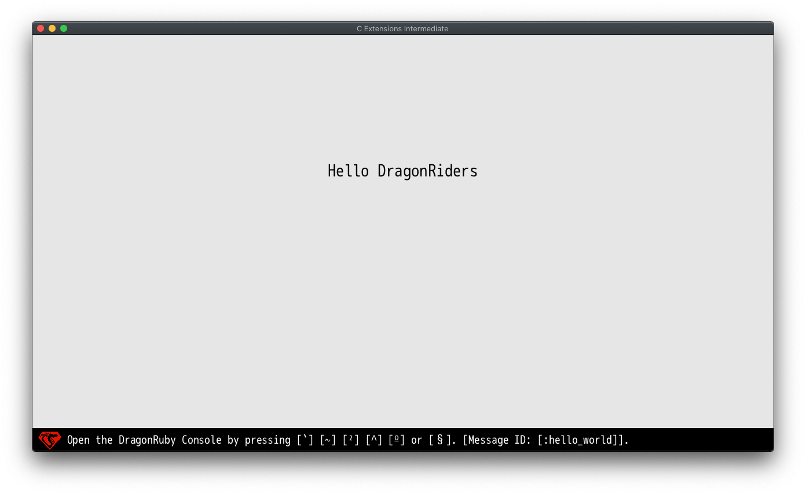

# Rust Extensions introduction

This sample app is the next step on mastering Rust extensions for the
DragonRuby Game Toolkit. You'll need a Pro License which can be purchased at
http://dragonruby.org. The sample app is provided in the Standard license for
those that are curious as to what implementing Rust Extensions looks like.

## Requirements

Make sure you went through the first example '01_basics'.
This sample currently only runs on macos but should run on any target that Rust can build for.

## Regular Expressions

This sample shows how to use a third-party Rust library. We use a library for
regular expressions: https://github.com/rust-lang/regex.

This library comes with C bindings which we have extracted and lightly modified to work with this example. The changes made were to the bundled C header file in `regex-capi/include/rure.h` to add Dragonruby FFI annotations and to the `regex-capi/Cargo.toml` file to add an explicit dependency on regex version 1.4.2 which is the release these C bindings were extracted from.

We need to generate bindings from the header file. By default, DragonRuby generates bindings under `CExt`
module. This can be overriden by `--ffi-module=` command line flag.

Run the following command from Linux/macOS terminal:

```
> ./dragonruby-bind --output=mygame/ext-bindings.c --ffi-module=RURE regex-capi/include/rure.h
```

Now you can compile the library together with the generated bindings.

On macOS:

```
> clang -shared \
  -isystem include -I . -I regex-capi/include -fPIC \
  -o mygame/native/macos/ext.dylib native/ext-bindings.c regex-capi/target/release/librure.dylib
```

Now, the Rust extension is available under the `FFI::RURE` namespace.

```
$gtk.ffi_misc.gtk_dlopen("ext")
include FFI::RURE
```

The `rure` library exposes several functions but we only use one here:

```rust
bool rure_find(rure *re, const uint8_t *haystack, size_t length,
               size_t start, rure_match *match);
```

The first argument is the regex pattern to search for. The second one is the
actual text we want to search through. The third argument is the starting position within the text. The fourth argument is the length of the text. The last argument is a pointer to a rure_match struct: it stores the location of the start and end character positions found in the text.
The function returns 1 if a match occurred and 0 otherwise. The rure_match struct will be updated with the start and end locations if a match occurs.

The usage in DragonRuby is straightforward:

```ruby
$gtk.ffi_misc.gtk_dlopen("ext")
include FFI::RURE

input = "<<Hello, DragonRiders!>>"
matches = Rure_matchPointer.new
re = rure_compile_must("\\w+")
if rure_find(re, input, input.length, 0, matches) == 1
  puts "Found a word (#{matches[0].start}, #{matches[0].end}): '#{input.slice(matches[0].start...matches[0].end)}'"
end

def tick args
end
```

When you run the game you should see `Found a word (2, 7): 'Hello'` on the console.
A few things worth mentioning. This API requires usage of structs and struct pointers. It also API requires `const char *` and `rure_match *`.
In case of strings, DragonRuby does the transformation for you transparently.
In the case of `rure_match *` you have to create the right pointer manually (`Rure_matchPointer.new`).
The good thing is that you don't need to free or deallocate this memory manually:
DragonRuby also does this for you transparently.

With this knowledge, we can now create a slightly more complex function that
splits input into an array of words:

```ruby
$gtk.ffi_misc.gtk_dlopen("ext")
include FFI::RURE

def split_words(input)
  matches = Rure_matchPointer.new
  words = []
  re = rure_compile_must("\\w+")
  while rure_find(re, input, input.length, 0, matches) == 1
    words << input.slice(matches[0].start...matches[0].end)
    input = input.slice(matches[0].end, input.length)
  end
  words
end

def tick args
  input = "<<Hello, DragonRiders!>>"
  args.outputs.labels  << [640, 500, split_words(input).join(' '), 5, 1]
end
```
 
Now, you should see a big label with "Hello DragonRiders" on it.


